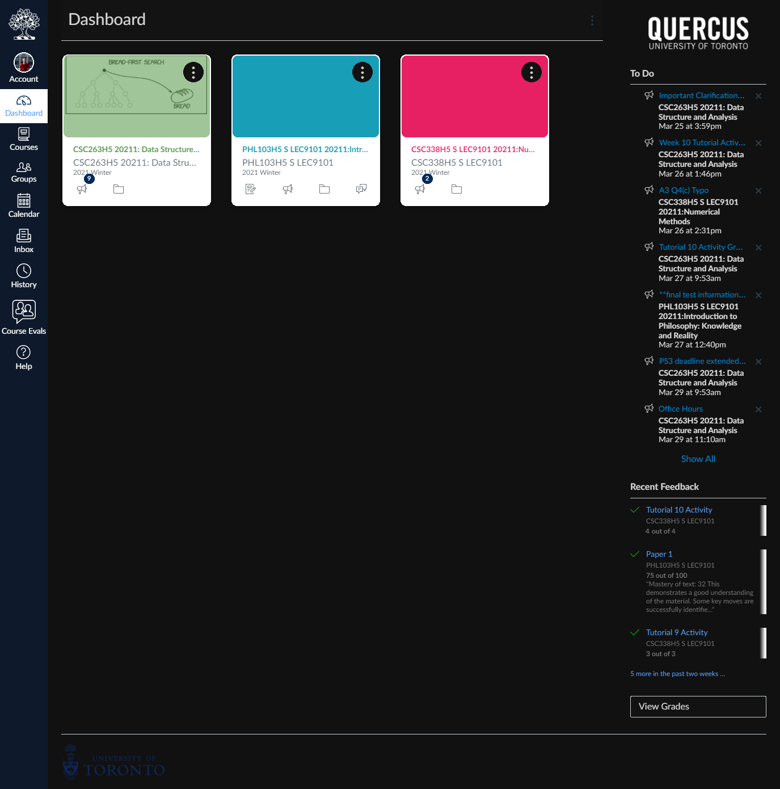
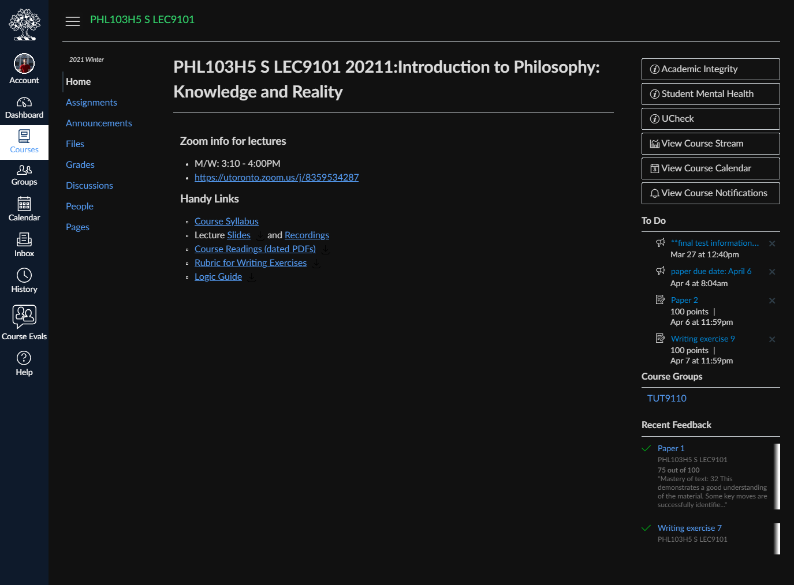
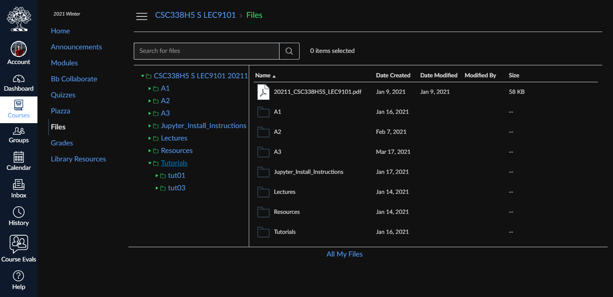
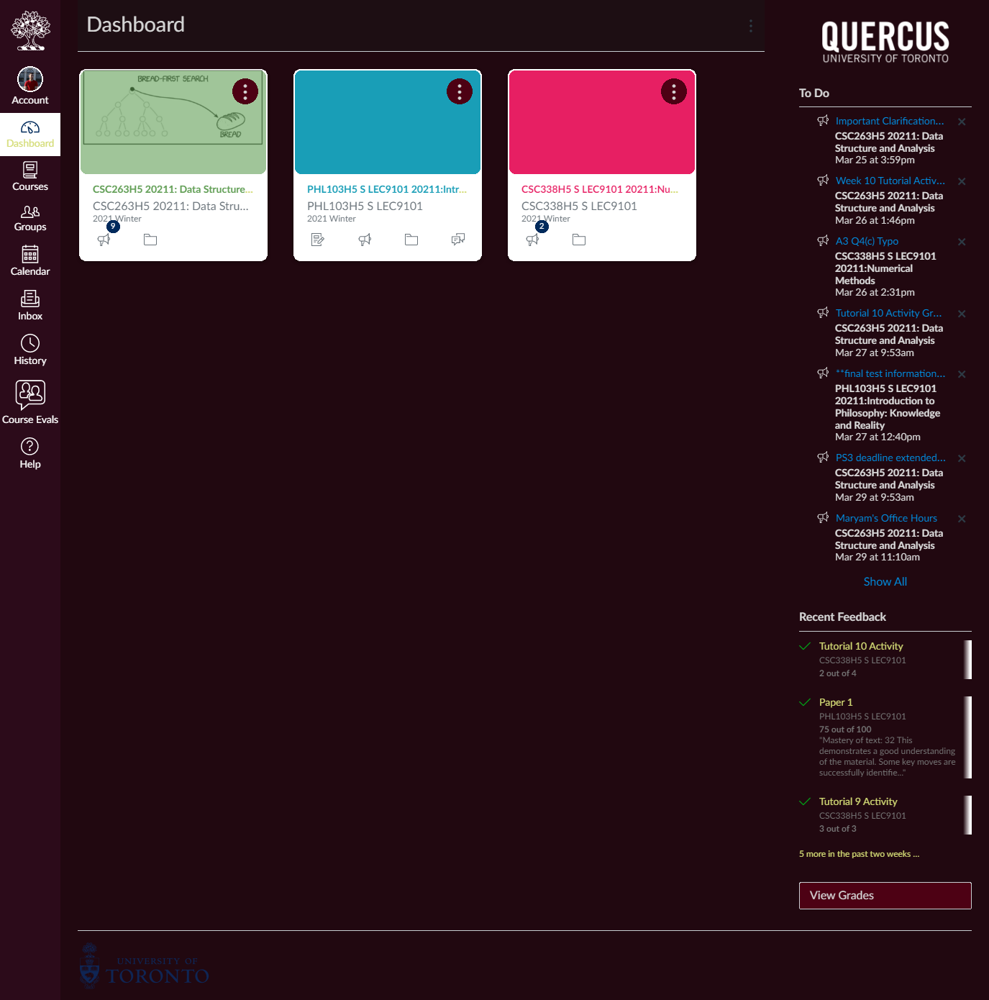
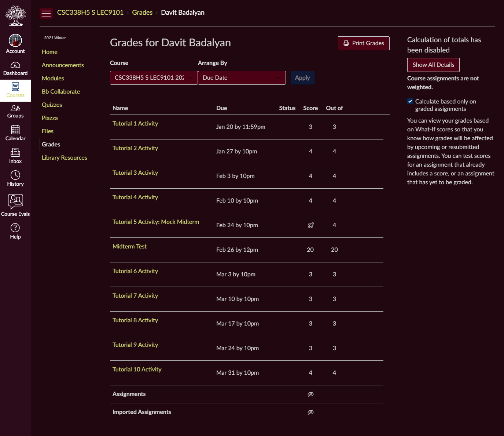
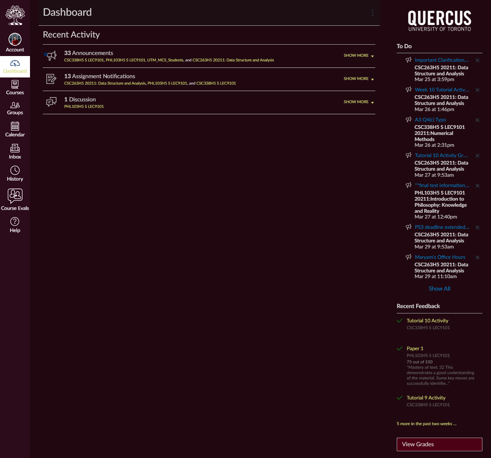

# Quercus Dark Theme
Dark theme for Quercus | University of Toronto

## Installation

1. Install [Stylus for Firefox](https://addons.mozilla.org/en-US/firefox/addon/styl-us/), [Chrome](https://chrome.google.com/webstore/detail/stylus/clngdbkpkpeebahjckkjfobafhncgmne), [Opera](https://addons.opera.com/en-gb/extensions/details/stylus/) or [Cascadea for Safari](https://cascadea.app/).
2. Install [quercus-dark.user.css](https://github.com/badalya1/quercus-dark/raw/main/quercus-dark.user.css).

## Preview

## Additional Themes

Through settings, you can achieve custom themes like this

